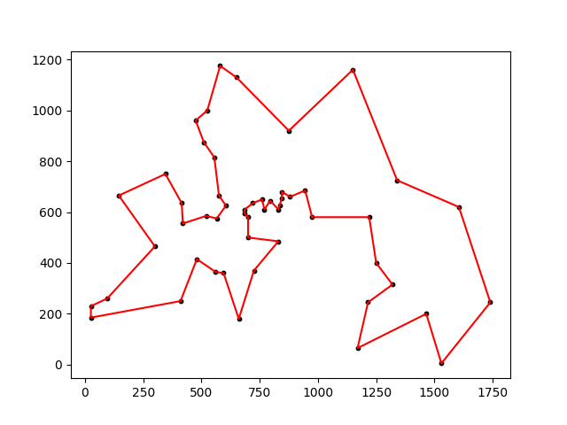
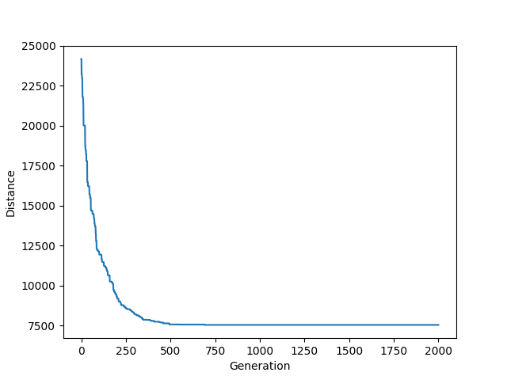

# GA_berlin52_TSP
a GA algorithm implement that can reach a good result in berlin52(TSP problem).

If you want to know what is Genetic Algorithm, please check the original tutorial.
The original tutorial is in [Here](https://towardsdatascience.com/evolution-of-a-salesman-a-complete-genetic-algorithm-tutorial-for-python-6fe5d2b3ca35)  
  

## The BASE Strategies:  
(1)Fitness:f(X)=X  
(2)Elitist strategy  
(3)Selection:Tournament selection  
    
## More strategies:  
(1)We don’t think the individuals with bad performance can truly improve the final result, so we only use the half individuals which have better performance to do the GA each generation.  
(2)We think it is better that our populations are big, so that we can have more choices.  
(3)We think it is dangerous that MUTATION will destroy some good DNA,so we keep the MUTATION a low number.(In this experiment,we don't mutate at all).  
  
## About the final distance:
The final distance may not the best answer(7544) all the time, you can try more strategies to improve the performance constantly.

## The result shows here:
  
  
  

